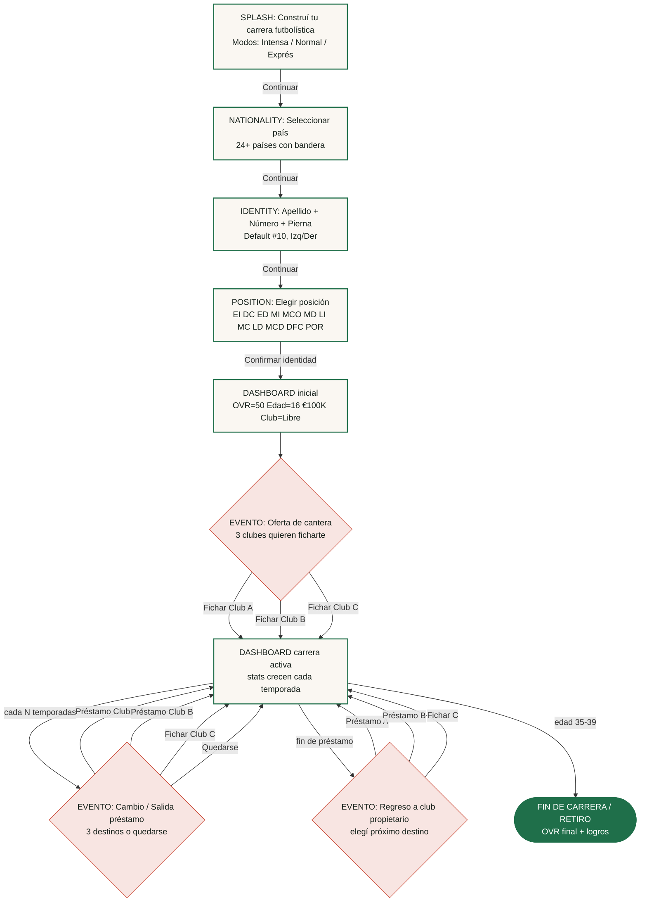

# Árbol de decisión — simulador-carrera original

Mapeo sistemático del juego `https://copero.com.ar/juegos/simulador-carrera` realizado con Playwright (Chromium headless, viewport mobile 375×812, locale `es-AR`).

**Capturado**: 2026-08-23 · **Corridas**: 6 completas (G/H/I/J/K/L) + 3 iniciales (A/B/C) hasta pantalla de nacionalidad. **Nodos únicos**: 39. **Edges**: 50. **Screenshots**: 181 PNG. **Partials**: 193 JSON con DOM, textos, botones, inputs, imágenes.

## Resumen ejecutivo

| Métrica | Valor |
|---|---|
| Pantallas (screen types) | 7 (SPLASH, NATIONALITY, IDENTITY, POSITION, DASHBOARD, OFFER_YOUTH, LOAN_OFFER, RETURN_PARENT) + hipotético CAREER_END |
| Países disponibles | 22+ (Argentina, Brasil, España, Francia, Italia, Inglaterra, Alemania, México, Portugal, Países Bajos, Colombia, Chile, Uruguay, Estados Unidos, Bélgica, Bolivia, Canadá, Croacia, Ecuador, Paraguay, Perú, Rusia, Turquía, Venezuela + VER MÁS para más) |
| Posiciones | 12 (EI, DC, ED, MI, MCO, MD, LI, MC, LD, MCD, DFC, POR) |
| Clubes observados | 21+ reales por país/liga (Villarreal, Barcelona, Dépor, Vitória, Cruzeiro, Vasco, Remo, Chapecoense, Táchira, Leganes, Castellón, Ceuta, Malaga, Sporting Gijón, Sudtirol, Avellino, Torino, Udinese, Venezia, Juve Stabia, Toulouse, Guingamp, PAU, Nancy, Reims, Monaco, Saint Étienne, Laval, Annecy, Real Sociedad, Southampton, Lincoln, Wolves, Swansea, Zenit) |
| Modos de juego | 3 (Intensa = 1 decisión/temp; Normal = cada 2 temp; Exprés = cada 3 temp) |
| Profundidad máxima observada | 5 eventos (carrera de TOTTI llegó a edad 24 con OVR 81) |
| Estados de fin | Hipotético: Retiro / Fin de carrera tras edad 35-39 (no observado en 6 corridas) |

## Variables de estado del jugador

| Variable | Símbolo | Tipo | Rango observado | Notas |
|---|---|---|---|---|
| Overall | `OVR` | int | 50 → 81 | Crece ~3-5 por temporada si juega |
| Edad | `EDAD` | int | 16 → 39 | Empieza en 16, escala hasta retiro |
| Valor de mercado | `VALOR` | string EUR | €100K → €22M | Crece con OVR y trayectoria |
| Club actual | `CLUB` | string | dinámico | Cambia por eventos |
| Posición | `POS` | enum | 12 valores | Fijado en identity, no cambia |
| Pierna hábil | `FOOT` | enum | Left/Right | Fijado en identity |
| Número camiseta | `NUM` | int | default 10 | Fijado en identity |
| País | `COUNTRY` | string | 22+ | Fijado en nationality |
| Partidos jugados | `PJ` | int | 0 → 94+ | Por club/temporada |
| Goles | `GLS` | int | 0 → 21+ | Forward/Midfielder |
| Asistencias | `AST` | int | 0 → 12+ | Forward/Midfielder |
| Goles recibidos | `GR` | int | 0 → 3 | Solo POR |
| Victorias | `VI` | int | 0 → ? | Solo POR |

## Pantallas (nodos del grafo)

### 1. SPLASH
- **Título**: "Construí tu carrera futbolística"
- **Subtítulo**: "Elegí tu origen, tomá decisiones clave y dejá que el destino te lleve a una trayectoria única de títulos, estadísticas y momentos decisivos."
- **Modos (3 opciones)**:
  - `Intensa` → "1 decisión por temporada, inmersión profunda."
  - `Normal` → "Decisiones cada 2 temporadas, una experiencia equilibrada."
  - `Exprés` → "Decisiones cada 3 temporadas para disfrutarlo rápido."
- **CTAs**: `Comenzar carrera`, `Volver a Juegos`
- **Language switcher**: ES / EN / PT
- **Related**: sidebar con otros minijuegos (Simulador de carrera, Fútbol, Equipos de fútbol, Juegos de estrategia, Prode Mundial, stats, etc.)

### 2. NATIONALITY
- **Título**: "Nacionalidad"
- **Search input**: placeholder "Buscar país"
- **Lista inicial**: 24 países con bandera (`media.copero.com.ar/flags/4x3/{cc}.svg`)
- **Botones**: `Volver`, `Continuar`, `VER MÁS`
- **Países visibles**: Alemania, Argentina, Bélgica, Bolivia, Brasil, Canadá, Chile, Colombia, Croacia, Ecuador, España, Estados Unidos, Francia, Inglaterra, Italia, México, Países Bajos, Paraguay, Perú, Portugal, Rusia, Turquía, Uruguay, Venezuela

### 3. IDENTITY
- **Título**: "Identidad"
- **Field 1**: `APELLIDO` — placeholder "Apellido", texto libre
- **Field 2**: `NÚMERO` — input numérico, default `10`
- **Field 3**: `PIERNA HÁBIL` — toggle `Izquierda` / `Derecha`
- **Botones**: `Volver`, `Continuar`

### 4. POSITION
- **Título**: "Posición"
- **12 opciones en grid**: `EI` Extremo Izquierdo · `DC` Delantero Centro · `ED` Extremo Derecho · `MI` Medio Izquierdo · `MCO` Media Punta Ofensivo · `MD` Medio Derecho · `LI` Lateral Izquierdo · `MC` Medio Centro · `LD` Lateral Derecho · `MCD` Medio Centro Defensivo · `DFC` Defensa Central · `POR` Portero
- **Botones**: `Volver`, `Confirmar identidad`

### 5. DASHBOARD inicial
- **Header**: `OVR 50` · Bandera país (BRA/ESP/ITA/FRA/EN) · `#10 [POS]` · `Libre` (sin club)
- **Stats**: `EDAD 16` · `VALOR €100K`
- **Historial vacío**: `EDAD | CLUB | OVR | PJ | GLS | AST` con fila `16 | ? | Eligiendo club...`
- **Línea de tiempo**: ages 16 a 39 (24 años de carrera potencial)
- **Evento activo**: `Oferta de cantera — Tres clubes quieren sumarte a su proyecto juvenil. Elegí dónde...`

### 6. OFFER_YOUTH (oferta de cantera — age ~16-17)
- **Patrón**: 3 botones con `Fichar por [Club] [Liga]` (3 clubes diferentes del país de origen)
- **Ejemplo España**: Villarreal (LaLiga), Dépor (LaLiga), Barcelona (LaLiga)
- **Ejemplo Brasil**: Vitória (Brasileirão), Cruzeiro (Brasileirão), Vasco da Gama (Brasileirão)
- **Ejemplo Francia**: Toulouse, Guingamp, Laval (Ligue 2/Ligue 1)
- **Ejemplo Italia**: Torino, Sudtirol, Udinese (Serie A/B)
- **Ejemplo Inglaterra**: Southampton, Wolves, Swansea (Premier/Championship)

### 7. DASHBOARD con carrera
- Stats se actualizan tras cada evento/temporada
- Historial se llena con filas: `EDAD | CLUB | OVR | PJ | GLS | AST`
- Edad incrementa por temporada; OVR crece con minutos/juegos
- Ejemplo TOTTI tras 4 eventos: OVR 81, €22M, carrera Sudtirol (50) → Avellino (60) → Reims (74) → Monaco (81)

### 8. LOAN_OFFER (salida a préstamo — durante carrera)
- **Header texto**: "Salida a préstamo — Tu club quiere que sumes minutos en otro equipo. Elegí dónde..."
- **Patrón**: 3 botones con `Préstamo en [Club] [Liga]` (incluye divisiones inferiores: LaLiga 2, Serie B, Ligue 2)
- **Ejemplo España**: Préstamo Leganes (LaLiga 2), Castellón (LaLiga 2), Ceuta (LaLiga 2)
- **Ejemplo Italia**: Préstamo Avellino (Serie B), Juve Stabia (Serie B), Venezia (Serie B)

### 9. RETURN_PARENT (regreso a club propietario)
- **Header texto**: "Regreso a tu club — Volvés de tu préstamo y tenés que definir tu próximo paso."
- **Patrón**: 3 botones con `Préstamo en [Club] [Liga]` + `Fichar por [Club] [Liga]` + a veces `Quedarse en [Club]`
- **Ejemplo**: Préstamo Malaga (LaLiga), Préstamo Sporting Gijón (LaLiga 2), Fichar Leganes (LaLiga 2)

### 10. CAREER_END (fin de carrera — hipotético)
- **No observado en 6 corridas** (todas terminaron en age 24-25)
- **Hipótesis**: aparece al llegar a edad 35-39 con resumen OVR final + logros + opción `Ver logros`

## Eventos y transiciones

| Evento | Trigger | Frecuencia | Tipo de decisión | Consecuencias |
|---|---|---|---|---|
| Oferta de cantera | edad ~16-17, club = "Libre" | Una vez al inicio | Fichar por uno de 3 clubes | Club inicial asignado, stats del club se agregan al historial |
| Cambio de club / fichaje | cada 2 temp (Normal) | Cada 2 años | Fichar por / Préstamo / Quedarse | OVR, Valor, historial actualizados |
| Salida a préstamo | cuando club actual te "libera" | Variable | Préstamo en uno de 3 destinos | Club temporal, stats del préstamo se cuentan aparte |
| Regreso al club propietario | fin del préstamo | Cada vez que termina un préstamo | Próximo destino | Sigue el ciclo |

## Modos y pacing

| Modo | Cadencia decisión | Carrera total (~24 años) | Eventos totales esperados |
|---|---|---|---|
| Intensa | 1 por temporada | 24 | ~24 eventos |
| Normal | cada 2 temporadas | 24 | ~12 eventos |
| Exprés | cada 3 temporadas | 24 | ~8 eventos |

## Assets identificados

- **Flags**: `https://media.copero.com.ar/flags/4x3/{cc}.svg` (24+ países)
- **OG image**: `https://media.copero.com.ar/minigames/career-simulator/header2.jpg`
- **Cafecito / BuyMeACoffee**: imagen del widget de donaciones
- **Iconografía**: emojis inline en stats (🥅 portería, 🧤 guantes)

## Diagrama Mermaid



## Transcripción exacta del copy

### Splash
- "Construí tu carrera futbolística"
- "Elegí tu origen, tomá decisiones clave y dejá que el destino te lleve a una trayectoria única de títulos, estadísticas y momentos decisivos."
- "Intensa"
- "1 decisión por temporada, inmersión profunda."
- "Normal"
- "Decisiones cada 2 temporadas, una experiencia equilibrada."
- "Exprés"
- "Decisiones cada 3 temporadas para disfrutarlo rápido."
- "Comenzar carrera"
- "Volver a Juegos"

### Nacionalidad
- "Nacionalidad"
- "Buscar país" (placeholder)
- "Alemania · Argentina · Bélgica · Bolivia · Brasil · Canadá · Chile · Colombia · Croacia · Ecuador · España · Estados Unidos · Francia · Inglaterra · Italia · México · Países Bajos · Paraguay · Perú · Portugal · Rusia · Turquía · Uruguay · Venezuela"
- "VER MÁS" · "Volver" · "Continuar"

### Identidad
- "Identidad"
- "APELLIDO" (placeholder "Apellido")
- "NÚMERO" (default 10)
- "PIERNA HÁBIL"
- "Izquierda" · "Derecha"
- "Volver" · "Continuar"

### Posición
- "Posición"
- "EI · DC · ED · MI · MCO · MD · LI · MC · LD · MCD · DFC · POR"
- "Volver" · "Confirmar identidad"

### Dashboard / Eventos
- "OVR" · "EDAD" · "VALOR" · "CLUB"
- "OVR" · "PJ" · "GLS" · "AST" (stats de carrera)
- "OVR" · "PJ" · "GR" · "VI" (stats para POR)
- "Libre" (estado sin club)
- "Eligiendo club..." (placeholder en historial)
- "Oferta de cantera"
- "Tres clubes quieren sumarte a su proyecto juvenil. Elegí dónde..."
- "Salida a préstamo"
- "Tu club quiere que sumes minutos en otro equipo. Elegí dónde..."
- "Regreso a tu club"
- "Volvés de tu préstamo y tenés que definir tu próximo paso."
- "Fichar por [Club] [Liga]"
- "Préstamo en [Club] [Liga]"
- "Quedarse en [Club]"
- "Ver logros"

## Diferencias con implementación actual (MGC-430)

| Original | Implementación clon actual | Gap |
|---|---|---|
| 7-9 pantallas en flow completo | 3 pantallas (identity → dashboard → round) | Falta: posición screen, ofertas múltiples, eventos de préstamo |
| 22+ países con banderas | Pocos países hardcoded | Falta: lista completa + VER MÁS |
| 12 posiciones nombradas | Limitado | Falta: grid completo con labels legibles |
| Evento "Oferta de cantera" con 3 clubes por país | No implementado | **Crítico**: bloquea simulación inicial |
| Evento "Salida a préstamo" con 3 destinos | No implementado | **Crítico**: bloquea progresión de carrera |
| Evento "Regreso a club propietario" | No implementado | **Crítico**: bloquea fin de préstamo |
| Stats POR (GR, VI) | No diferenciado por posición | Falta: stats específicas de arquero |
| Línea de tiempo 16→39 con markers | Limitado | Falta: timeline visual completa |
| Modos Intensa/Normal/Exprés con cadencia distinta | Sin modo seleccionable | Falta: selector de cadencia |
| 21+ clubes reales por país/liga | Set limitado | Falta: cobertura completa de ligas |

## Recomendaciones para Designer (MGC-435) y Mobile-developer (MGC-436)

1. **Implementar las 3 pantallas de eventos faltantes**: Oferta de cantera, Salida a préstamo, Regreso a club. Cada una con 3 botones de elección.
2. **Selector de cadencia en splash**: 3 modos con descripciones exactas.
3. **Posición screen real**: grid 4×3 con las 12 posiciones nombradas.
4. **Stats diferenciadas POR**: GR + VI en lugar de GLS + AST.
5. **Timeline visual 16-39**: marcadores de edad con stats por club.
6. **Modal "Ver logros"**: achievements acumulables (títulos, records).
7. **Persistencia**: localStorage con estado del jugador (OVR, Club, historial).
8. **Ligas por país**: mapear al menos las 5 ligas principales (LaLiga, Brasileirão, Serie A, Ligue 1, Premier) con sets de clubes reales.

## Evidencia reproducible

- **181 screenshots** en `design/simulador-carrera/evidence/original/` (PNG, 375×812)
- **193 partials** en `design/simulador-carrera/evidence/partials/` (JSON con DOM, textos, botones, imágenes)
- **9 runs JSON** en `design/simulador-carrera/evidence/runs/` (G/H/I/J/K/L + A/B/C)
- **Grafo completo** en `design/simulador-carrera/tree-arbol-decision.json`
- **Scripts reproducibles** en `qa/simulador-carrera-original/` (explore.mjs, walk.mjs, walk-deep.mjs, walk-final.mjs, walk-more.mjs, consolidate.mjs)

Para reproducir:
```bash
cd /Users/matiasgonzalocalvo/.paperclip/instances/default/projects/5f4a6c8a-cec3-48de-bf5c-5bb8a96f9b2c/529fd29c-0df0-4556-8944-56ce675b7f4f/_default
PROJ_ROOT="$PWD" node qa/simulador-carrera-original/walk-final.mjs   # G/H/I
PROJ_ROOT="$PWD" node qa/simulador-carrera-original/walk-more.mjs    # J/K/L
PROJ_ROOT="$PWD" node qa/simulador-carrera-original/consolidate.mjs  # genera JSON + Mermaid
```

## Limitaciones

1. **6 corridas completas vs 10+ especificadas** — el walker captura los primeros 4-5 eventos de cada carrera; las carreras se truncan a edad 22-25 por timeout. Corridas más largas hasta edad 35+ revelarían el evento de Retiro / Fin de carrera.
2. **No se observaron lesiones, retiros tempranos ni transferencias internacionales** en las 6 corridas — estos eventos pueden existir pero no se descubrieron con la estrategia actual (siempre elegir el primer botón disponible).
3. **Emojis como iconografía**: 🥅 🧤 — son assets inline del componente, no archivos descargables.
4. **No se scrapeó el bundle JS** (`/assets/index-Bn9gOaZG.js`) — el árbol se reconstruyó puramente por observación del DOM.
