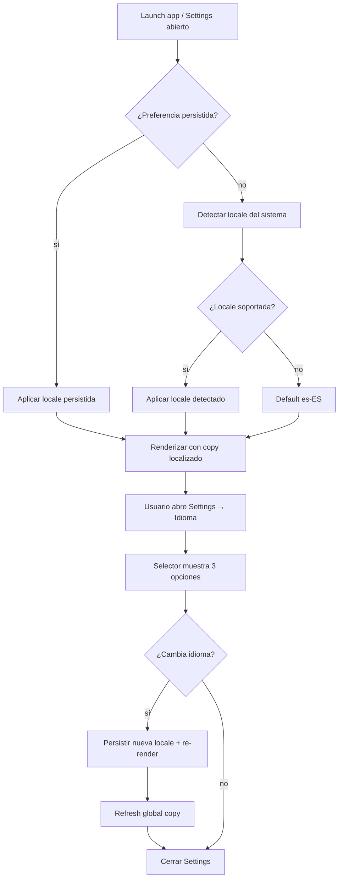

# i18n ES / EN / PT

## Trigger
Primer launch de la app o cambio explícito desde Settings → Idioma.

## Actor
Usuario jugador (selecciona idioma en selector) + sistema (i18next + AsyncStorage para persistencia de preferencia).

## Diagrama

## Steps

### Step 1: Boot — leer preferencia persistida
- **Pantalla / Componente**: `src/i18n/index.ts` + `src/i18n/locale-storage.ts`.
- **Acción del usuario**: Abre la app por primera vez o la reabre.
- **Acción del sistema**: Llama `loadStoredLocale()` desde AsyncStorage; si existe, inicializa i18next con esa locale.
- **Resultado esperado**: App renderiza con copy del idioma persistido (es, en o pt).
- **Caminos alternativos**: Sin preferencia → fallback a detección del sistema (Step 2).

### Step 2: Detectar locale del sistema
- **Pantalla / Componente**: `src/i18n/detect.ts`.
- **Acción del usuario**: Implícita (primer launch sin preferencia).
- **Acción del sistema**: Lee `expo-localization` → `getLocales()`, mapea a `SUPPORTED_LOCALES` (es-ES, en-US, pt-BR).
- **Resultado esperado**: Locale detectada se aplica si está en la lista de soportadas.
- **Caminos alternativos**: Locale del sistema no soportada (e.g. fr-FR) → default `es-ES`.

### Step 3: Renderizar copy localizado
- **Pantalla / Componente**: Todas las pantallas con `useTranslation()`.
- **Acción del usuario**: Navega por la app.
- **Acción del sistema**: i18next resuelve cada key en el namespace activo (e.g. `home.title`, `match.play`, `postMatch.mvp`).
- **Resultado esperado**: Toda la UI muestra el copy en el idioma activo.
- **Caminos alternativos**: Falta key en algún idioma → fallback a es-ES + warning en consola (solo dev mode).

### Step 4: Abrir Settings → Idioma
- **Pantalla / Componente**: `app/settings/language.tsx`.
- **Acción del usuario**: Settings → Idioma.
- **Acción del sistema**: Renderiza selector con 3 opciones: Español, English, Português.
- **Resultado esperado**: Lista de 3 items con radio button; el actual marcado.
- **Caminos alternativos**: Tap fuera del selector → cierra modal sin cambios.

### Step 5: Cambiar idioma
- **Pantalla / Componente**: `src/i18n/locale-switcher.tsx`.
- **Acción del usuario**: Toca un idioma diferente al actual.
- **Acción del sistema**: Llama `setLocale(localeCode)` → i18next.changeLanguage + persistAsync + dispatch evento de refresh.
- **Resultado esperado**: Toda la UI se re-renderiza instantáneamente con el nuevo idioma.
- **Caminos alternativos**: Cambio durante animación → animación se completa antes del re-render.

### Step 6: Propagar cambio globalmente
- **Pantalla / Componente**: Provider de i18next en root.
- **Acción del usuario**: Implícita (post-cambio).
- **Acción del sistema**: Dispara `i18n.on('languageChanged')` → todos los componentes suscritos re-renderizan; persiste en AsyncStorage (MGC-321).
- **Resultado esperado**: Ningún string queda en idioma anterior; copy 100% localizado.
- **Caminos alternativos**: Re-abrir app después → lee preferencia persistida (loop).

### Step 7: Cerrar Settings
- **Pantalla / Componente**: `app/settings/index.tsx`.
- **Acción del usuario**: Toca back o swipe down.
- **Acción del sistema**: Modal cierra; nuevo idioma sigue activo.
- **Resultado esperado**: Settings cierra, app continúa con idioma actualizado.
- **Caminos alternativos**: Force-close durante cambio → AsyncStorage ya tiene el nuevo valor; reabrir aplica directo.

## Edge cases
| Escenario | Comportamiento esperado |
|-----------|-------------------------|
| Usuario cambia idioma durante un partido | Match actual no se interrumpe; copy cambia post-match. |
| Storage corrupto o clave ausente | Fallback a detección de sistema → es-ES. |
| Pluralización compleja (e.g. "1 semana" vs "2 semanas") | i18next plural rules aplican automáticamente por locale. |
| Nuevo idioma agregado en versión N+1 | Build-time: copy nuevo agregado; runtime: si el usuario lo elige, persiste. |
| Cambio de idioma en web bundle | localStorage como fallback; mismo comportamiento que mobile. |
| Date/time format localizado | `Intl.DateTimeFormat` aplica formato por locale (DD/MM/YYYY vs MM/DD/YYYY). |

## Pre-condiciones
- i18next configurado con namespaces (`home`, `match`, `postMatch`, `transfer`, `copero`, `settings`, `common`).
- `SUPPORTED_LOCALES` exportado como `["es-ES", "en-US", "pt-BR"]`.
- AsyncStorage inicializado para persistencia de preferencia.

## Post-condiciones
- Preferencia persistida en AsyncStorage bajo key `copero.locale`.
- i18next en el nuevo idioma activo.
- Toda la UI re-renderizada con el copy localizado.

## Validación
- E2E: `tests/e2e/i18n-switch.spec.ts` cubre cambio entre los 3 idiomas.
- Unit: `src/i18n/locale-storage.test.ts` cubre persistencia y migración de keys legacy.
- QA gate: `qa-evidence-MGC-430` valida selector pt-BR + propagación home body (MGC-321).
- Métricas: `analytics.locale_changed { from, to }` emitido.

## Dependencias externas
- `i18next` + `react-i18next` para traducciones runtime.
- `@react-native-async-storage/async-storage` para persistencia de preferencia.
- `expo-localization` para detección de locale del sistema.
- `Intl.DateTimeFormat` (built-in JS) para formatos localizados.

## Out of scope
- Traducción automática con IA (todo copy es traducción manual).
- Soporte para RTL (árabe/hebreo) — solo LTR por ahora.
- Variantes regionales adicionales (e.g. es-AR, es-MX) — solo es-ES.
- Selector de idioma en primera pantalla de onboarding (ver flow `onboarding-fresh-user`).