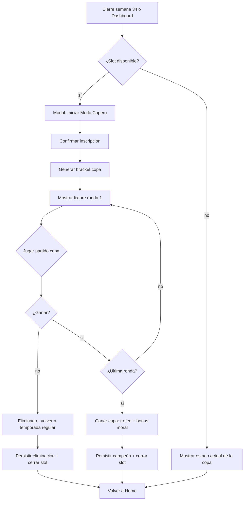

# Modo Copero (copa nacional)

## Trigger
Cierre de la temporada regular (semana 34) o entrada directa desde Dashboard "Modo Copero" (botón persistente en home cuando hay slot disponible).

## Actor
Usuario jugador (inscribe equipo, gestiona alineación en copa) + sistema (motor F4 copa nacional con bracket determinista).

## Diagrama

## Steps

### Step 1: Detectar slot disponible para Modo Copero
- **Pantalla / Componente**: `src/services/copa/persistence.ts` + `app/simulador-carrera/home.tsx`.
- **Acción del usuario**: Toca banner "Modo Copero disponible" en Home.
- **Acción del sistema**: Evalúa `careerStore.coperoSlot === null` y `currentWeek <= 34`; muestra banner solo si ambas condiciones se cumplen.
- **Resultado esperado**: Banner visible con CTA "Iniciar Modo Copero".
- **Caminos alternativos**: Slot ocupado → no muestra banner; semana > 34 → banner oculto hasta rollover.

### Step 2: Confirmar inscripción
- **Pantalla / Componente**: `src/services/copa/inscription.tsx`.
- **Acción del usuario**: Toca "Inscribir equipo" en modal de confirmación.
- **Acción del sistema**: Persiste `careerStore.coperoSlot = { tournamentId, seed, startedAtSeason }`, genera fixture de 4 rondas (32 equipos → 16 → 8 → final).
- **Resultado esperado**: Modal cierra, banner cambia a "Modo Copero activo · Ronda 1".
- **Caminos alternativos**: Cancelar inscripción → slot permanece libre; ya inscrito → no muestra modal.

### Step 3: Generar bracket copa nacional
- **Pantalla / Componente**: `src/services/copa/CopaBracket.ts`.
- **Acción del usuario**: Implícita (post-inscripción).
- **Acción del sistema**: Llama `generateBracket(seed)` con RNG determinista ADR-0016, siembra 32 equipos por ranking, asigna al jugador como seed según posición en tabla.
- **Resultado esperado**: Bracket renderizado en pantalla `copa/bracket.tsx` con 5 rondas visibles (32, 16, 8, semis, final).
- **Caminos alternativos**: Sin 32 equipos → ajusta a potencia de 2 más cercana con byes.

### Step 4: Jugar partido de copa
- **Pantalla / Componente**: `app/simulador-carrera/match.tsx` (mismo motor que temporada).
- **Acción del usuario**: Toca partido programado en bracket.
- **Acción del sistema**: `simulateMatch(copaContext = true)` resuelve con peso estadístico levemente diferente (sore copa nacional = 1.1×) — referencia ADR-0017.
- **Resultado esperado**: Resultado del partido con badge "Copa nacional · Ronda N".
- **Caminos alternativos**: Empate → tanda de penales (único modo donde aplica; temporada regular permite empate).

### Step 5: Avanzar ronda o ser eliminado
- **Pantalla / Componente**: `src/services/copa/advance.ts`.
- **Acción del usuario**: Toca "Siguiente ronda" o ve modal de eliminación.
- **Acción del sistema**: Si victoria → avanza al siguiente partido del bracket; si derrota → cierra `coperoSlot`, persiste resultado, libera slot.
- **Resultado esperado**: Bracket actualizado si avanza; modal "Eliminado de la copa" si pierde.
- **Caminos alternativos**: Walkover por W.O. → avanza automáticamente; lesión en copa → aplica rehab rápido (2× velocidad).

### Step 6: Ganar copa nacional (final)
- **Pantalla / Componente**: `src/services/copa/trophy.tsx` + `app/simulador-carrera/copero-trophy.tsx`.
- **Acción del usuario**: Toca "Ver trofeo" post-final.
- **Acción del sistema**: Renderiza animación de trofeo, persiste `careerStore.trophies.copero += 1`, dispara boost moral +15 al equipo.
- **Resultado esperado**: Pantalla de trofeo con animación 1.5s, badge "Campeón de la Copa N", transición a Home.
- **Caminos alternativos**: Modo portrait → trofeo fullscreen; landscape → trofeo + bracket final visible.

### Step 7: Cerrar slot y volver a Home
- **Pantalla / Componente**: `app/simulador-carrera/home.tsx`.
- **Acción del usuario**: Toca "Volver al inicio".
- **Acción del sistema**: Persiste `careerStore.coperoSlot = null`, dispara evento `analytics.copero_completed`.
- **Resultado esperado**: Home muestra semana actual de temporada regular con slot liberado.
- **Caminos alternativos**: Cierre durante animación → snapshot persiste y reanuda al reabrir.

## Edge cases
| Escenario | Comportamiento esperado |
|-----------|-------------------------|
| Jugador abandona durante una ronda de copa | Snapshot persiste (AC7 MGC-421); al reabrir retoma la ronda. |
| Eliminación temprana (ronda 1) | Slot liberado inmediatamente; puede reinscribirse la próxima temporada. |
| Copa con < 32 equipos | Bracket ajusta con byes automáticos; mismas reglas de avance. |
| Walkover por W.O. | Avanza automáticamente; adversario es eliminado sin match. |
| Lesión grave durante copa | Rehab 2× velocidad; persiste lesión en historial. |
| Modo Copero activo + fin de temporada | Copa tiene prioridad; rollover se difiere hasta cerrar copa o ser eliminado. |
| Copa coincide con playoffs | Solo se puede jugar uno a la vez (semáforo: copa tiene prioridad si slot activo). |

## Pre-condiciones
- Carrera activa (`careerStore.currentSeason >= 1`).
- `weekIndex <= 34` (no se inicia después de playoffs).
- Slot libre (`coperoSlot === null`).

## Post-condiciones
- Si campeón: `careerStore.trophies.copero` +1, moral +15 persistente.
- Si eliminado: slot liberado, historial de copa persiste en `coperoHistory[]`.
- Telemetría: `analytics.copero_started`, `analytics.copero_completed`, `analytics.copero_eliminated`.

## Validación
- E2E: `tests/e2e/copero-bracket.spec.ts` cubre inscripción → final → trofeo.
- Unit: `src/services/copa/__tests__/bracket.test.ts` cubre byes y siembra.
- Métricas: `analytics.copero_trophy_shown` y win rate agregado.
- QA: corrida manual valida animación de trofeo < 1.5s.

## Dependencias externas
- AsyncStorage para persistencia de slot y bracket.
- RNG determinista (ADR-0016) para generación de bracket.
- `react-native-reanimated` para animación de trofeo.
- i18n para copy de copa (ver flow `i18n-es-en-zh-CN-pt-BR`; locales canónicos `SUPPORTED_LOCALES = es/en/zh-CN/pt-BR` definidos en `src/i18n/copy.ts`).

## Out of scope
- Copa internacional / sudamericana (futuro feature).
- Copa con eliminación doble (ida y vuelta) — actualmente eliminación directa.
- Sistema de sponsor económico por participar en copa.
- Bracket editable manualmente por el jugador.