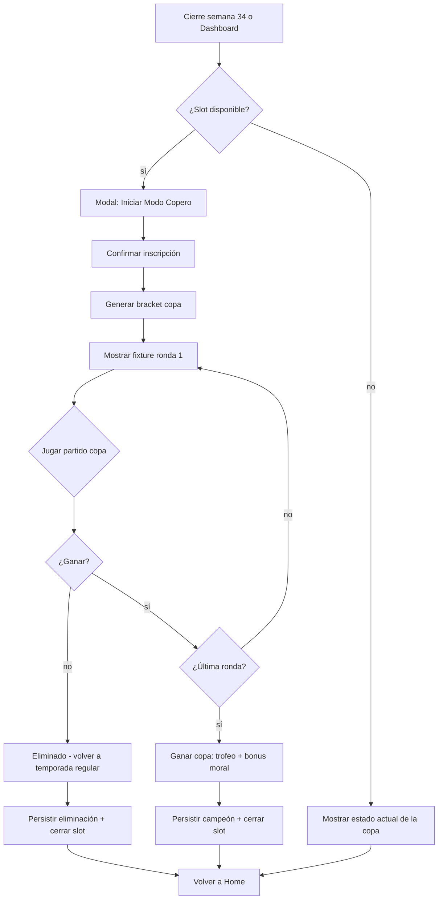

# Modo Copero (copa nacional)

## Trigger
Cierre de la temporada regular (semana 34) o entrada directa desde Dashboard "Modo Copero" (botón persistente en home cuando hay slot disponible).

## Actor
Usuario jugador (inscribe equipo, gestiona alineación en copa) + sistema (motor F4 copa nacional con bracket determinista).

## Diagrama


## Steps

### Step 1: Detectar slot disponible para Modo Copero
- **Pantalla / Componente**: `src/features/copero/slot.ts` + `app/simulador-carrera/home.tsx`.
- **Acción del usuario**: Toca banner "Modo Copero disponible" en Home.
- **Acción del sistema**: Evalúa `careerStore.coperoSlot === null` y `currentWeek <= 34`; muestra banner solo si ambas condiciones se cumplen.
- **Resultado esperado**: Banner visible con CTA "Iniciar Modo Copero".
- **Caminos alternativos**: Slot ocupado → no muestra banner; semana > 34 → banner oculto hasta rollover.

### Step 2: Confirmar inscripción
- **Pantalla / Componente**: `src/features/copero/inscription.tsx`.
- **Acción del usuario**: Toca "Inscribir equipo" en modal de confirmación.
- **Acción del sistema**: Persiste `careerStore.coperoSlot = { tournamentId, seed, startedAtSeason }`, genera fixture de 4 rondas (32 equipos → 16 → 8 → final).
- **Resultado esperado**: Modal cierra, banner cambia a "Modo Copero activo · Ronda 1".
- **Caminos alternativos**: Cancelar inscripción → slot permanece libre; ya inscrito → no muestra modal.

### Step 3: Generar bracket copa nacional
- **Pantalla / Componente**: `src/features/copero/bracket.ts` + `src/features/copero/slot.ts`.
- **Acción del usuario**: Implícita (post-inscripción).
- **Acción del sistema**: `CopaBracket.generate(input, snapshot)` consume el `RngSnapshot` vigente (ADR-0016 D3) vía `createRngFromSnapshot(snapshot)` y avanza `cursor` monotónicamente (ADR-0016 D1, AC6). Siembra 32 equipos por ranking y asigna al jugador como seed según posición en tabla. Devuelve `{ bracket, snapshot }`; el snapshot actualizado se persiste atómicamente con el resto del `careerStore` (ADR-0016 D2).
- **Resultado esperado**: Bracket renderizado en `app/simulador-carrera/copero/bracket.tsx` con 5 rondas visibles (32, 16, 8, semis, final), `RngSnapshot` actualizado y persistido en AsyncStorage clave `copero.copa.v1` con `cursor` post-generate.
- **Caminos alternativos**: < 32 equipos → ajusta a potencia de 2 más cercana con byes (no se sortean cruces nulos). Snapshot corrupto → recovery vía `restoreRng(defaultSeed)` y log a Sentry.
- **Render del fallbackNotice**: la UI sólo debe mostrar `fallbackNotice` cuando `bracket.size < 32` (es decir, `usedFallback === true`). Si la UI usa `bracket.usedFallback` sin chequear `bracket.size`, va a renderizar el notice incluso cuando `usedFallback` quede en `false` por error de flujo, contradiciendo el contrato de producto. Verificar `bracket.size < 32` antes de mostrar el banner (`fallbackNoticeTitle` + `fallbackNoticeBody`).
- **AC6**: `createRngFromSnapshot(snapshot).rngInt(0, 31) === snapshot.nextInt` en el primer draw.

### Step 4: Jugar partido de copa
- **Pantalla / Componente**: `app/simulador-carrera/match.tsx` (mismo motor que temporada).
- **Acción del usuario**: Toca partido programado en bracket.
- **Acción del sistema**: `simulateMatch(copaContext = true)` resuelve con peso estadístico levemente diferente (sore copa nacional = 1.1×) — referencia ADR-0017.
- **Resultado esperado**: Resultado del partido con badge "Copa nacional · Ronda N".
- **Caminos alternativos**: Empate → tanda de penales (único modo donde aplica; temporada regular permite empate).

### Step 5: Avanzar ronda o ser eliminado
- **Pantalla / Componente**: `src/features/copero/advance.ts`.
- **Acción del usuario**: Toca "Siguiente ronda" o ve modal de eliminación.
- **Acción del sistema**: Si victoria → avanza al siguiente partido del bracket; si derrota → cierra `coperoSlot`, persiste resultado, libera slot.
- **Resultado esperado**: Bracket actualizado si avanza; modal "Eliminado de la copa" si pierde.
- **Caminos alternativos**: Walkover por W.O. → avanza automáticamente; lesión en copa → aplica rehab rápido (2× velocidad).

### Step 6: Ganar copa nacional (final)
- **Pantalla / Componente**: `src/features/copero/trophy.tsx` + `app/simulador-carrera/copero-trophy.tsx`.
- **Acción del usuario**: Toca "Ver trofeo" post-final.
- **Acción del sistema**: Renderiza animación de trofeo, persiste `careerStore.trophies.copero += 1`, dispara boost moral +15 al equipo.
- **Resultado esperado**: Pantalla de trofeo con animación 1.5s, badge "Campeón de la Copa N", transición a Home.
- **Caminos alternativos**: Modo portrait → trofeo fullscreen; landscape → trofeo + bracket final visible.

### Step 7: Cerrar slot y volver a Home
- **Pantalla / Componente**: `app/simulador-carrera/home.tsx`.
- **Acción del usuario**: Toca "Volver al inicio".
- **Acción del sistema**: Persiste `careerStore.coperoSlot = null`, dispara evento `analytics.copero_completed`.
- **Resultado esperado**: Home muestra semana actual de temporada regular con slot liberado.
- **Caminos alternativos**: Cierre durante animación → snapshot persiste y reanuda al reabrir.

## Edge cases
| Escenario | Comportamiento esperado |
|-----------|-------------------------|
| Jugador abandona durante una ronda de copa | `RngSnapshot` persiste (AC7 MGC-421); al reabrir retoma la ronda desde el último `cursor` committed. |
| Eliminación temprana (ronda 1) | Slot liberado inmediatamente; puede reinscribirse la próxima temporada. |
| Copa con < 32 equipos | Bracket ajusta con byes automáticos (potencia de 2 más cercana); mismas reglas de avance. |
| Walkover por W.O. | Avanza automáticamente; adversario eliminado sin match; `RngSnapshot` avanza 0 draws (skip). |
| Lesión grave durante copa | Rehab 2× velocidad; persiste lesión en historial. |
| Modo Copero activo + fin de temporada | Copa tiene prioridad; rollover se difiere hasta cerrar copa o ser eliminado. |
| Copa coincide con playoffs | Solo se puede jugar uno a la vez (semáforo: copa tiene prioridad si slot activo). |
| Empate en partido de copa | Tanda de penales única vía `rngInt(0, 31)` determinista del `RngSnapshot` (AC7). |
| Empate en fase regular | Tiebreaker: puntos > diferencia de gol > goles a favor > `rngInt(0, 31)` determinista del `RngSnapshot` (AC7 — sin randomness "pura"). |

## AC adicionales (MGC-485 v2)

### AC7 — Tiebreaker determinista
Orden de desempate fase regular: **puntos** → **diferencia de gol** → **goles a favor** → **`rngInt(0, 31)`** con `RngSnapshot` vigente. Sin `Math.random()`. El draw se persiste en `careerStore.copaTiebreakerLog[]` para auditoría.

### AC8 — Determinismo byte-equal
Test obligatorio `src/features/copero/copa.determinism.test.ts` ejecuta **100 iteraciones** del flujo completo inscripción → bracket → final con la misma `seed` y compara byte-a-byte el `RngSnapshot` final. Diff > 0 → falla el test → bloquea el merge del PR de implementación (MGC-497). Sin AC8 verde, MGC-497 no mergea.

### AC9 — Persistencia copa slot v1
Clave AsyncStorage: `copero.copa.v1`. Schema:
```ts
type CopaSlotV1 = {
  v: 1;
  tournamentId: string;
  seed: number;
  startedAtSeason: number;
  rngSnapshot: RngSnapshot;
  bracket: CopaRonda[][];
};
```
`v: 1` discriminador. Migración futura vía discriminador nuevo (`v: 2`).

### AC10 — i18n copa
4 locales: `es`, `en`, `pt-BR`, `it`. Claves nuevas en namespace `copero.copa.*`. Sin hardcoded strings en TSX (i18n-first).

## Pre-condiciones
- Carrera activa (`careerStore.currentSeason >= 1`).
- `weekIndex <= 34` (no se inicia después de playoffs).
- Slot libre (`coperoSlot === null`).

## Post-condiciones
- Si campeón: `careerStore.trophies.copero` +1, moral +15 persistente.
- Si eliminado: slot liberado, historial de copa persiste en `coperoHistory[]`.
- Telemetría: `analytics.copero_started`, `analytics.copero_completed`, `analytics.copero_eliminated`.

## Validación
- E2E: `tests/e2e/copero-bracket.spec.ts` cubre inscripción → final → trofeo.
- Unit: `src/features/copero/bracket.test.ts` cubre byes y siembra.
- **AC8**: `src/features/copero/copa.determinism.test.ts` — 100 iter byte-equal **bloqueante de merge**.
- Métricas: `analytics.copero_trophy_shown` y win rate agregado.
- QA: corrida manual valida animación de trofeo < 1.5s.

## Cambios vs v1 (MGC-485)
1. **CopaBracket consume RngSnapshot** (ADR-0016 D3) — bracket generate usa `createRngFromSnapshot` y persiste cursor.
2. **Tiebreaker explícito** (AC7): puntos > dif > goles > `rngInt(0, 31)` determinista (sin `Math.random()`).
3. **Engine seed vía `createRngFromSnapshot` con cursor monotónico** (ADR-0016 D1, AC6).
4. **AC8 test determinismo 100 iter byte-equal** — agregada como bloqueante de merge del PR MGC-497.
5. **CI gate #1 IN_PROGRESS no bloquea merge** — aclarado: la gate #1 (PR base `in_progress`) es señal de avance, no de bloqueo. Bloqueantes reales: AC8 fallida, review REQUEST_CHANGES, conflict sin resolver.

## Dependencias externas
- AsyncStorage para persistencia de slot y bracket.
- RNG determinista (ADR-0016) para generación de bracket.
- `react-native-reanimated` para animación de trofeo.
- i18n para copy de copa (ver flow `i18n-es-en-pt`).

## Out of scope
- Copa internacional / sudamericana (futuro feature).
- Copa con eliminación doble (ida y vuelta) — actualmente eliminación directa.
- Sistema de sponsor económico por participar en copa.
- Bracket editable manualmente por el jugador.