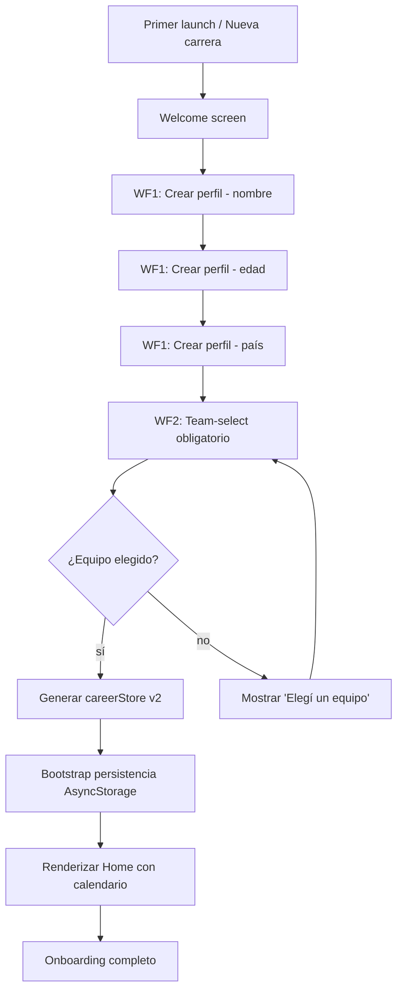

# Onboarding fresh user

## Trigger
Primer launch de la app con AsyncStorage vacío (sin `careerStore.currentSeason`) o toque explícito en "Nueva carrera" desde Home.

## Actor
Usuario jugador nuevo (completa formularios de identidad y selección de equipo) + sistema (persistencia inicial + creación de `careerStore` v2).

## Diagrama

## Steps

### Step 1: Welcome screen
- **Pantalla / Componente**: `app/onboarding/welcome.tsx`.
- **Acción del usuario**: Abre la app por primera vez.
- **Acción del sistema**: Detecta AsyncStorage vacío → renderiza welcome con logo y copy "Bienvenido a Copero".
- **Resultado esperado**: Welcome screen fullscreen con CTA "Empezar".
- **Caminos alternativos**: Re-apertura con carrera existente → salta directo a Home; toque en "Nueva carrera" desde Home → vuelve a welcome.

### Step 2: Crear perfil — nombre
- **Pantalla / Componente**: `app/onboarding/identity/name.tsx` + `src/features/identity/name-input.tsx`.
- **Acción del usuario**: Toca input y completa su nombre (1–40 chars).
- **Acción del sistema**: Validación onChangeText vía `shouldCommitNativeText` (MGC-2940); persiste en `identityDraft.name`.
- **Resultado esperado**: Input acepta texto sin colapsar a 16 (MGC-3014); CTA "Siguiente" se habilita cuando hay contenido válido.
- **Caminos alternativos**: Nombre con caracteres no permitidos → toast "Solo letras y espacios"; input vacío → CTA deshabilitado.

### Step 3: Crear perfil — edad
- **Pantalla / Componente**: `app/onboarding/identity/age.tsx` + `src/features/identity/age-input.tsx`.
- **Acción del usuario**: Ingresa edad (16–50 años permitidos).
- **Acción del sistema**: Validación con `lastTypedAgeRef` para evitar stale nativeEvent.text (MGC-3022); blur usa fallback al ref.
- **Resultado esperado**: Edad válida aceptada; rango se muestra como helper text.
- **Caminos alternativos**: Edad fuera de rango → toast "Debe ser entre 16 y 50"; edad vacía → CTA deshabilitado.

### Step 4: Crear perfil — país
- **Pantalla / Componente**: `app/onboarding/identity/country.tsx`.
- **Acción del usuario**: Selecciona país de una lista (40+ países).
- **Acción del sistema**: Persiste `identityDraft.country` (código ISO-2); valida que esté en lista permitida.
- **Resultado esperado**: País seleccionado se muestra con bandera y nombre.
- **Caminos alternativos**: País no listado → buscar manualmente; back gesture → vuelve a edad.

### Step 5: Team-select obligatorio (WF2)
- **Pantalla / Componente**: `app/onboarding/team-select.tsx` + `src/features/onboarding/team-select.tsx`.
- **Acción del usuario**: Elige equipo de una lista de 10 clubes predeterminados.
- **Acción del sistema**: MGC-1648: WF2 obligatorio, no permite avanzar sin selección. Renderiza tarjetas con escudo y rating OVR.
- **Resultado esperado**: Equipo seleccionado, CTA "Empezar carrera" habilitado.
- **Caminos alternativos**: Sin equipo elegido → CTA deshabilitado con copy "Elegí un equipo para continuar".

### Step 6: Generar careerStore v2
- **Pantalla / Componente**: `src/features/career/career-store.ts`.
- **Acción del usuario**: Toca "Empezar carrera".
- **Acción del sistema**: Crea `careerStore` con: `currentSeason: 1`, `weekIndex: 1`, `teamId`, `identity`, `history: []`, `trophies: { copero: 0 }`, `pendingOffers: []`. Slot inicializa con `payload v: 2` (MGC-2999).
- **Resultado esperado**: Store inicializado con valores válidos.
- **Caminos alternativos**: Migración de save legacy (`copero-career`) → aplica back-compat (MGC-385).

### Step 7: Bootstrap persistencia AsyncStorage
- **Pantalla / Componente**: `src/features/persistence/bootstrap.ts` (MGC-722).
- **Acción del usuario**: Implícita.
- **Acción del sistema**: Llama `bootstrapPersistence()` en layouts native/web; configura listener `AppState` para auto-save.
- **Resultado esperado**: AsyncStorage inicializado, primer save programado.
- **Caminos alternativos**: Force-stop antes del primer save → al reabrir, identity draft se pierde; re-onboarding.

### Step 8: Renderizar Home con calendario
- **Pantalla / Componente**: `app/simulador-carrera/home.tsx`.
- **Acción del usuario**: Ve Home con su calendario semana 1.
- **Acción del sistema**: Renderiza home con: badge de equipo, semana actual, próximo partido, navegación a partido/calendario/post-match.
- **Resultado esperado**: Home funcional con temporada 1 semana 1 visible.
- **Caminos alternativos**: Sin conexión → banner offline; volver a onboarding → reset explícito (ver flow `restart-limpio`).

## Edge cases
| Escenario | Comportamiento esperado |
|-----------|-------------------------|
| Usuario cierra app durante WF1 (nombre) | identity draft persiste; al reabrir retoma en WF1 con nombre pre-llenado. |
| Migración desde save legacy v1 | Back-compat automático (MGC-385): upgrade a v2 con datos preservados. |
| Idioma seleccionado durante onboarding | Ver flow `i18n-es-en-pt` — selector aparece como paso opcional WF0. |
| Force-stop durante bootstrap persistencia | Al reabrir, retry automático; si falla 3× → modal "Reintentar". |
| Usuario menor de 16 años | Validación bloquea (gate regulatorio); copy "Debe ser mayor de 16". |
| Sin conexión a internet durante onboarding | Onboarding funciona offline (datos locales); no requiere red. |
| Nombre duplicado entre jugadores | Permitido (no es unique key); cada carrera tiene UUID distinto. |

## Pre-condiciones
- App instalada (Expo SDK + dependencias).
- AsyncStorage vacío o con `restart-limpio` ejecutado previamente.
- Sin `careerStore.currentSeason` activo.

## Post-condiciones
- `careerStore.currentSeason === 1`, `weekIndex === 1`.
- `identity`, `teamId`, `history: []`, `trophies.copero: 0` inicializados.
- AsyncStorage con key `copero-career-v2` poblada.
- Calendario de 38 semanas listo para `weekIndex: 1`.
- Onboarding completo: usuario listo para jugar semana 1.

## Validación
- E2E: `tests/e2e/onboarding.spec.ts` cubre WF1 → WF2 → Home.
- Unit: `src/features/identity/name-input.test.ts` cubre MGC-2940 (shouldCommitNativeText).
- Métricas: `analytics.onboarding_completed` con payload `{ teamId, country, duration }`.
- QA: corrida manual `qa-evidence-MGC-430` cubre identity input edge cases.

## Dependencias externas
- AsyncStorage para persistencia de identity draft y careerStore.
- `react-native-reanimated` para transiciones de onboarding.
- i18n para copy localizado (ver flow `i18n-es-en-pt`).
- Componente `Welcome` y navegación nativa (expo-router).

## Out of scope
- Login con Apple/Google (futuro feature).
- Sincronización cloud entre dispositivos.
- Selección de avatar / foto de perfil.
- Onboarding con video tutorial (futuro feature).