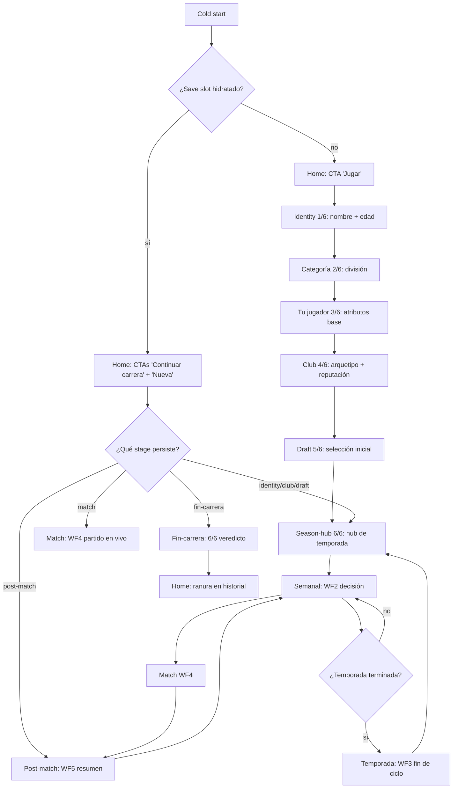

# Copero — Overview / Product Flow

> Football-manager mobile (React Native + Expo). Cliente-only: sin
> backend, persistencia local en AsyncStorage. Imitación del loop
> de carrera de [copero.com.ar](https://copero.com.ar/).

> **Detalle de la feature principal**: el flow 6-pasos de onboarding
> MGC-209 vive en `docs/flows/identity-onboarding/flow.md` (a
> producir por flow-architect en pase siguiente).

## Trigger
Cold start desde el icono de la app, o tap "Continuar carrera" cuando
ya existe sesión persistida.

## Actor
Jugador de football-manager. Single-player, offline-only. Dispositivo
iOS / Android (mobile) + bundle web (Expo export) para iteración QA.

## Diagrama

## Steps

### Step 1: Home (cold start)
- **Pantalla / Componente**: `app/index.tsx` (`HomeScreen`)
- **Acción del usuario**: tap "Jugar" (sin save slot) o tap "Continuar carrera" / "Nueva carrera" (con save slot)
- **Acción del sistema**: lee `AsyncStorage` → `hydrateFromSave()`; dispatcher puro en `_layout.native.tsx` espera `hydrated=true` antes de pintar Stack
- **Resultado esperado**: hero + título + descripción + CTA principal visible
- **Caminos alternativos**:
  - `pm clear` cold-start → solo "Jugar" (label depende de `stage`)
  - save slot corrupto → reset con confirmación del operador
  - con sesión persistida → "Continuar carrera" + "Nueva carrera"

### Step 2: Identity (1/6 onboarding)
- **Pantalla / Componente**: `app/simulador-carrera/identity.tsx` (wrapper) → `src/features/simulador-carrera/screens/identity.tsx`
- **Acción del usuario**: tipea nombre + edad del jugador, tap "Continuar"
- **Acción del sistema**: guarda en `saveSlot.payload.draft`; valida edad con `shouldCommitNativeText` (gate MGC-2940/MGC-3035 `clearOnFocus`)
- **Resultado esperado**: navega a Categoría (2/6)
- **Caminos alternativos**:
  - nombre vacío → deshabilita CTA hasta input válido
  - edad fuera de rango [14, 45] → warning inline, no bloquea
  - back press → confirma "¿Salir y perder progreso?"

### Step 3: Categoría (2/6) + Tu jugador (3/6) + Club (4/6) + Draft (5/6)
- **Pantalla / Componente**: `app/simulador-carrera/categoria.tsx`, `tu-jugador.tsx`, `club.tsx`, `draft.tsx`
- **Acción del usuario**: elige división, revisa atributos base, selecciona club por arquetipo/reputación, hace draft inicial del plantel
- **Acción del sistema**: persiste cada paso en `saveSlot.payload.draft`; mutación atómica con `createSlot` payload v:2 (MGC-2999)
- **Resultado esperado**: llega a Season-hub con carrera inicializada
- **Caminos alternativos**:
  - cancelar draft → vuelve a Club (4/6) sin perder progreso anterior
  - club sin cupo → oculta opción y muestra tooltip
  - AsyncStorage lleno → warning + sugiere borrar slot antiguo

### Step 4: Season-hub (6/6) — loop semanal
- **Pantalla / Componente**: `app/simulador-carrera/season-hub.tsx` (WF1 hub) → `semanal.tsx` (WF2 decisión)
- **Acción del usuario**: revisa stats, fatiga, próximo partido; toma decisión semanal (entrenar / descansar / evento social)
- **Acción del sistema**: aplica modificadores a stats; agenda próximo `Match` o `social-event`; UPDATE `saveSlot.stage='semanal'`
- **Resultado esperado**: siguiente WF se renderiza en la cola del hub
- **Caminos alternativos**:
  - evento social disparado → tap navega a `social-events` antes de match
  - lesión grave durante la semana → salta a Post-match con resultado forzado
  - temporada terminada → salta a Temporada (WF3) en lugar de Semana

### Step 5: Match (WF4 partido en vivo)
- **Pantalla / Componente**: `app/simulador-carrera/match.tsx` → `src/features/simulador-carrera/screens/match.tsx`
- **Acción del usuario**: tap para ver cada evento narrado del partido (gol, falta, cambio)
- **Acción del sistema**: corre simulación `resolveMatch()`; genera eventos; actualiza `playerStats` y `teamStats`
- **Resultado esperado**: navega a Post-match al finalizar
- **Caminos alternativos**:
  - app killed mid-match → al reabrir, ofrece "Reanudar partido" en next stage
  - red inestable (no aplica: offline-only)
  - error en RNG seed → fallback a snapshot determinista (MGC-1676 RNG snapshot v2)

### Step 6: Post-match (WF5 resumen) + Fin-carrera
- **Pantalla / Componente**: `app/simulador-carrera/post-match.tsx` → `fin-carrera.tsx`
- **Acción del usuario**: revisa resumen, decide "Volver al hub" / "Nueva temporada" / "Retirar jugador"
- **Acción del sistema**: UPDATE `saveSlot.stage`; al "Retirar" genera resumen final con score + veredicto
- **Resultado esperado**: vuelve a Season-hub o termina en Home con slot en historial
- **Caminos alternativos**:
  - temporada completa antes de "Retirar" → fuerza WF3 `temporada.tsx` antes de `fin-carrera`
  - retirarse mid-temporada → permite pero marca como "retiro prematuro"

## Edge cases

| # | Caso | Comportamiento esperado |
|---|------|--------------------------|
| 1 | Save slot corrupto / versión incompat | Ofrecer reset con confirmación; backup automático pre-reset |
| 2 | AsyncStorage lleno | Warning inline + CTA "Borrar slot antiguo" antes de bloquear el flujo |
| 3 | App killed durante un step (identity, match, post-match) | `hydrateFromSave` re-entrará en el último `stage` persistido con banner "Continuar carrera" |
| 4 | Draft sin cupo en club seleccionado | Club se renderiza deshabilitado + tooltip explicando motivo |
| 5 | Edad del jugador fuera de rango válido | `shouldCommitNativeText` revierte keystroke inválido (MGC-2940/3035) |
| 6 | Temporada termina con jugador lesionado | Temporada (WF3) marca como "lesión de larga duración" y reduce stats |
| 7 | Multi-instancia de la app (race condition en AsyncStorage) | Defensa con `createSlot` payload v:2 + hydrate-from-save idempotente (MGC-2999) |

## Pre-condiciones
- App instalada (iOS, Android o web bundle de Expo)
- AsyncStorage accesible y con cuota libre
- Datos iniciales: save slot (creado en Step 1) o existente (re-anudado)

## Post-condiciones
- `saveSlot.payload` actualizado con stage + draft final
- `playerStats`, `teamStats`, `matchHistory` consistentes
- Cache de UI coherente con el último `stage`
- Historial en Home si la carrera se retiró

## Validación
- Maestro E2E: `e2e/mobile/home.yaml` cold-start + tap Jugar → identity visible
- Playwright: `e2e/simulador-carrera.spec.ts` happy path 6 pasos
- Playwright: `e2e/_visual-regression.spec.ts` snapshot de cada pantalla (hub, match, post-match, fin-carrera)
- Crash recovery: kill app mid-match → reabrir → "Reanudar partido" en home
- Determinismo: misma seed RNG = mismo resultado de match (regression MGC-1676)

## Dependencias externas
- `expo` + `expo-router` (file-based routes, dispatch `_layout`)
- `@react-native-async-storage/async-storage` (save slot, offline persistence)
- `react-native` Lazy/Suspense (code-split de pantallas en `src/features/...`)
- Sin APIs remotas (cliente-only, offline-first)
- Sin backend ni auth (single-player local)

## Out of scope
- ❌ Multiplayer online / multiplayer local
- ❌ Sync cloud / cross-device (iCloud, Drive)
- ❌ Cuentas de usuario / auth / login social
- ❌ Notificaciones push (recordatorios de partido, eventos sociales)
- ❌ Monetización in-app (Ads se servirán desde sub-app separada — `docs/ads.md`)
- ❌ Ranking global / leaderboards
- ❌ Compartir carrera vía link o QR
- ❌ Deep linking a pantallas internas del simulador (sólo cold-start e icono)
- ❌ Realtime coach mode (coach interactivo durante el match)
