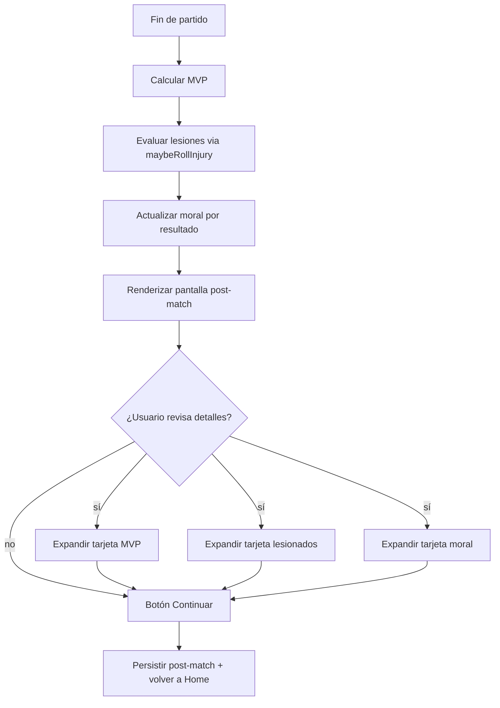

# Post-match — MVP, lesionados, moral

## Trigger
Cierre del partido simulado (transición de `app/simulador-carrera/match.tsx` → `post-match.tsx`).

## Actor
Usuario jugador (revisa el resumen post-partido) + sistema (motor que selecciona MVP, calcula lesionados y ajusta moral).

## Diagrama

## Steps

### Step 1: Calcular MVP del partido
- **Pantalla / Componente**: `src/features/career/post-match/mvp.ts` + `app/simulador-carrera/post-match.tsx`.
- **Acción del usuario**: Implícita (cálculo automático al cerrar partido).
- **Acción del sistema**: Aplica `pickMatchMVP(stats)` — el jugador con mayor `rating` ajustado por `positionFactor` recibe badge MVP; persistido en `matchHistory.mvpId`.
- **Resultado esperado**: Badge "MVP" visible en la tarjeta del jugador destacado.
- **Caminos alternativos**: Empate técnico → elige al de mayor `goals + assists`; lesionado temprano → badge queda en el reemplazante.

### Step 2: Evaluar lesionados post-match
- **Pantalla / Componente**: `src/features/career/injury-v2.ts#maybeRollInjury`.
- **Acción del usuario**: Implícita.
- **Acción del sistema**: Para cada jugador que participó, samplea `severityFor(kind)` con probabilidad según OVR; persiste `Injury { kind, affectedAttr, fechasOut, startedAtWeek }`.
- **Resultado esperado**: Tarjeta "Lesionados" muestra jugadores afectados con `kind` y semanas out.
- **Caminos alternativos**: Sin lesionados → tarjeta vacía con copy "Plantel completo"; 2+ lesionados → badge numérico rojo.

### Step 3: Ajustar moral del equipo
- **Pantalla / Componente**: `src/features/career/morale.ts`.
- **Acción del usuario**: Implícita.
- **Acción del sistema**: Aplica delta según resultado: victoria +6, empate +1, derrota -4; bonus goleada > 3 goles +4 adicional. Persiste `teamMorale`.
- **Resultado esperado**: Indicador de moral (0–100) en la tarjeta, animado con color (verde > 70, amarillo 40–70, rojo < 40).
- **Caminos alternativos**: Racha de 3+ victorias → boost +10; racha de 3+ derrotas → caída -8.

### Step 4: Renderizar pantalla post-match
- **Pantalla / Componente**: `app/simulador-carrera/post-match.tsx`.
- **Acción del usuario**: Visualiza resultado en landing post-match.
- **Acción del sistema**: Renderiza 3 tarjetas (MVP, lesionados, moral) con animaciones `react-native-reanimated` (~300ms cada una).
- **Resultado esperado**: Pantalla muestra resultado del partido, MVP con foto/stats, lesionados con badge, moral con barra.
- **Caminos alternativos**: Modo portrait → cards apiladas; landscape → cards en grid 3×1.

### Step 5: Expandir detalle MVP
- **Pantalla / Componente**: `src/features/career/post-match/mvp-card-expand.tsx`.
- **Acción del usuario**: Toca tarjeta MVP.
- **Acción del sistema**: Expande card mostrando: nombre, foto, posición, rating final, goles, asist, minutos jugados.
- **Resultado esperado**: Card expandida con todos los stats del MVP.
- **Caminos alternativos**: Tap fuera → colapsa; tap en foto → abre perfil completo del jugador.

### Step 6: Expandir detalle lesionados
- **Pantalla / Componente**: `src/features/career/post-match/injuries-card-expand.tsx`.
- **Acción del usuario**: Toca tarjeta lesionados.
- **Acción del sistema**: Expande lista con cada lesionado: nombre, tipo de lesión, semanas out estimadas, atributo afectado.
- **Resultado esperado**: Lista completa de lesionados con copy i18n localizado.
- **Caminos alternativos**: Sin lesionados → empty state con icono de plantel completo.

### Step 7: Expandir detalle moral
- **Pantalla / Componente**: `src/features/career/post-match/morale-card-expand.tsx`.
- **Acción del usuario**: Toca tarjeta moral.
- **Acción del sistema**: Expande card con: barra de progreso, delta post-partido, racha actual, próxima predicción basada en fixture.
- **Resultado esperado**: Card expandida con detalle completo del estado anímico.
- **Caminos alternativos**: Morale crítica (< 30) → banner rojo "Riesgo de conflicto grupal".

### Step 8: Continuar a Home
- **Pantalla / Componente**: `app/simulador-carrera/home.tsx`.
- **Acción del usuario**: Toca "Continuar".
- **Acción del sistema**: Persiste `postMatchSnapshot` en `careerStore`, dispara evento `analytics.post_match_viewed`, navega a Home.
- **Resultado esperado**: Vuelve a Home con semana actual visible y stats actualizadas.
- **Caminos alternativos**: Back gesture → confirmación "¿Salir sin revisar detalles?"; auto-save tras 5s.

## Edge cases
| Escenario | Comportamiento esperado |
|-----------|-------------------------|
| MVP empatado con 2+ jugadores | Elige al de mayor OVR; muestra "MVP compartido" si rating idéntico. |
| Lesión múltiple del mismo jugador en el mismo partido | Solo persiste la más grave (`kind = max`). |
| Equipo entero en moral crítica | Banner "Crisis grupal" + oferta de evento social F4 para revertir. |
| Force-stop durante la pantalla post-match | Snapshot persiste; al reabrir muestra última post-match vista. |
| Partido suspendido sin finalizar | No muestra post-match; vuelve al calendario con estado "pendiente". |
| Modo Copero activo (ver flow modo-copero) | Post-match agrega tarjeta adicional "Copa nacional: ronda N". |

## Pre-condiciones
- Partido simulado y finalizado en `matchHistory[]`.
- `simulateMatch()` ejecutado con seed determinista.
- Persistencia AsyncStorage activa.

## Post-condiciones
- `matchHistory` actualizado con `mvpId`, lesionados y moral delta.
- `teamMorale` actualizado en `careerStore`.
- `injuries[]` actualizado con nuevos lesionados (kind, affectedAttr, fechasOut, startedAtWeek).
- Telemetría `analytics.post_match_viewed` emitida.

## Validación
- E2E: `tests/e2e/post-match.spec.ts` cubre expandir/colapsar cada tarjeta.
- Unit: `src/features/career/post-match/mvp.test.ts` cubre empates y lesionados tempranos.
- Métricas: `analytics.mvp_badge_shown`, `analytics.injury_reported`.
- QA: corrida manual valida animaciones < 300ms (gate §5 `engineering-workflow`).

## Dependencias externas
- `react-native-reanimated` para animaciones de tarjetas.
- AsyncStorage para persistencia de post-match.
- RNG determinista (ADR-0016) para cálculo de lesiones.
- i18n para copy localizado (ver flow `i18n-es-en-pt`).

## Out of scope
- Post-match con videos/highlights.
- Sistema de entrevistas post-partido (futuro feature).
- Análisis táctico avanzado (futuro feature).
- Replay del partido.