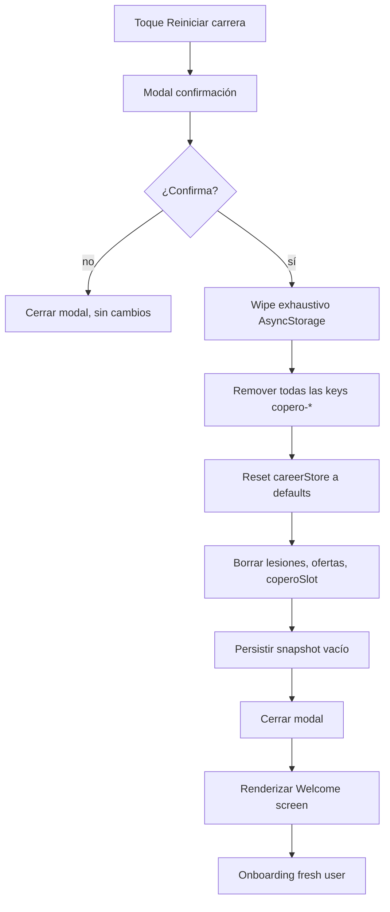

# Restart limpio

## Trigger
Toque explícito en Dashboard "Reiniciar carrera" (botón dev-only MGC-565 / visible para QA reproducible MGC-518) o modal de confirmación post-selección.

## Actor
Usuario jugador (confirma restart) + sistema (wipe exhaustivo de AsyncStorage + reset de `careerStore`).

## Diagrama

## Steps

### Step 1: Toque botón "Reiniciar carrera"
- **Pantalla / Componente**: `app/simulador-carrera/dashboard.tsx` + botón dev-only MGC-565.
- **Acción del usuario**: Toca "Reiniciar carrera" en Dashboard.
- **Acción del sistema**: Muestra modal de confirmación con copy "Esto borrará toda tu carrera. ¿Continuar?".
- **Resultado esperado**: Modal aparece con 2 botones: "Cancelar" y "Sí, reiniciar".
- **Caminos alternativos**: Sin carrera activa → no muestra botón; en producción → botón oculto (dev-only visible solo con flag).

### Step 2: Confirmar acción
- **Pantalla / Componente**: `src/features/persistence/restart-modal.tsx`.
- **Acción del usuario**: Toca "Sí, reiniciar".
- **Acción del sistema**: Llama `wipeCareerData()` (MGC-215 #647) — implementación exhaustiva que limpia todas las keys AsyncStorage relacionadas.
- **Resultado esperado**: Modal muestra spinner "Reiniciando..." durante el wipe.
- **Caminos alternativos**: Cancelar → modal cierra sin cambios; force-stop durante wipe → al reabrir, datos parciales quedan (no confiable).

### Step 3: Wipe exhaustivo AsyncStorage
- **Pantalla / Componente**: `src/features/persistence/wipe.ts` (MGC-215 wipe exhaustivo).
- **Acción del usuario**: Implícita post-confirmación.
- **Acción del sistema**: Itera todas las keys AsyncStorage; borra cualquier key con prefijo `copero-` (incluye `copero-career-v2`, `copero-career` legacy, `copero-locale`, `copero.identity-draft`, etc).
- **Resultado esperado**: AsyncStorage limpio, 0 keys con prefijo `copero-`.
- **Caminos alternativos**: Storage error → retry 2×; si persiste, mostrar error y revertir modal.

### Step 4: Reset careerStore a defaults
- **Pantalla / Componente**: `src/features/career/career-store.ts#reset`.
- **Acción del usuario**: Implícita.
- **Acción del sistema**: Reemplaza careerStore con valores iniciales: `currentSeason: null`, `weekIndex: null`, `teamId: null`, `identity: null`, `history: []`, `trophies: { copero: 0 }`, `pendingOffers: []`, `coperoSlot: null`.
- **Resultado esperado**: Store en estado "sin carrera activa".
- **Caminos alternativos**: Reset sin clear fire-and-forget (MGC-2606) — defensivo contra load asíncrono.

### Step 5: Limpiar lesiones, ofertas, coperoSlot
- **Pantalla / Componente**: `src/features/career/injuries.ts`, `transfer-offers`, `copero`.
- **Acción del usuario**: Implícita.
- **Acción del sistema**: Limpia listas auxiliares: `injuries: []`, `pendingOffers: []`, `coperoSlot: null`, `matchHistory: []`, `seasonHistory: []`.
- **Resultado esperado**: Todas las colecciones en estado vacío.
- **Caminos alternativos**: Datos huérfanos en `eventsLog` → también wipe (gate MGC-2606 3 corridas sin datos fantasma).

### Step 6: Persistir snapshot vacío
- **Pantalla / Componente**: `src/features/persistence/save-scheduler.ts`.
- **Acción del usuario**: Implícita.
- **Acción del sistema**: Persiste el nuevo `careerStore` (todo defaults) bajo key `copero-career-v2` para garantizar próximo load vea estado limpio.
- **Resultado esperado**: Snapshot vacío persistido.
- **Caminos alternativos**: Save falla → log error + warning al usuario; igual continúa con reset en memoria.

### Step 7: Cerrar modal
- **Pantalla / Componente**: `src/features/persistence/restart-modal.tsx`.
- **Acción del usuario**: Toca fuera del modal o back gesture.
- **Acción del sistema**: Modal cierra; navega a Welcome screen.
- **Resultado esperado**: Modal desaparece, transición a Welcome.
- **Caminos alternativos**: Animación de cierre 200ms; force-close modal → cierra igual.

### Step 8: Renderizar Welcome screen
- **Pantalla / Componente**: `app/onboarding/welcome.tsx`.
- **Acción del usuario**: Ve Welcome.
- **Acción del sistema**: `currentSeason === null` → renderiza Welcome con CTA "Empezar".
- **Resultado esperado**: Welcome screen visible, idéntico al primer launch.
- **Caminos alternativos**: Back gesture → no navega (welcome es root); telemetry `analytics.career_reset` emitida.

### Step 9: Iniciar onboarding fresh user
- **Pantalla / Componente**: `app/onboarding/identity/name.tsx` (ver flow `onboarding-fresh-user`).
- **Acción del usuario**: Toca "Empezar" en Welcome.
- **Acción del sistema**: Inicia WF1 (nombre) → WF2 (equipo) → Home.
- **Resultado esperado**: Nueva carrera desde cero.
- **Caminos alternativos**: Usuario abandona onboarding → siguiente launch vuelve a Welcome.

## Edge cases
| Escenario | Comportamiento esperado |
|-----------|-------------------------|
| Wipe parcial (algunas keys fallan) | Retry 2×; si persiste, log error y continúa (datos parciales pueden quedar). |
| Force-stop durante wipe | Snapshot queda inconsistente; al reabrir muestra Welcome (key principal vacía). |
| Reset sin clear fire-and-forget (MGC-2606) | Defense-in-depth: hydrateFromSave detecta store vacío y no intenta cargar. |
| Carrera cerrada con torneo activo | Wipe incluye `coperoSlot`, libera el slot antes de eliminar. |
| Modal abierto múltiples veces | Singleton: solo 1 modal visible a la vez (gate §1.6 self-heal). |
| Web bundle | localStorage.multiRemove equivalente a AsyncStorage wipe. |
| QA reproducibilidad (MGC-518) | Botón dev-only siempre visible en builds de QA; oculto en producción. |

## Pre-condiciones
- Carrera activa (`currentSeason >= 1`) — botón solo aparece si hay carrera.
- AsyncStorage inicializado.
- Modal de confirmación visible.

## Post-condiciones
- AsyncStorage: 0 keys con prefijo `copero-`.
- `careerStore.currentSeason === null`.
- Snapshot vacío persistido.
- Usuario en Welcome screen.
- Telemetría: `analytics.career_reset` emitida con payload `{ previousSeason, hadTrophies }`.

## Validación
- E2E: `tests/e2e/restart.spec.ts` cubre wipe → onboarding.
- Unit: `tests/unit/mgc215-restart-clears-all-keys.test.ts` (ya mergeado, referencia principal).
- Test unit: cobertura WF6 resetAll (MGC-1651) — 3 corridas sin datos fantasma.
- QA: corrida manual valida que tras restart no hay datos fantasma (gate MGC-2606).
- Métricas: `analytics.career_reset` + smoke post-restart de 30s sin errores.

## Dependencias externas
- `@react-native-async-storage/async-storage` (mobile) / `localStorage` (web).
- Wipe exhaustivo (MGC-215 #647 mergeado).
- Defense-in-depth `hydrateFromSave` (MGC-2606).
- Modal nativo con copy i18n (ver flow `i18n-es-en-pt`).

## Cross-references
- PR #647 — `feat(copero): MGC-215 — wipe exhaustivo + modal confirmación restart limpio` (mergeado, fuente del wipe).
- MGC-518 — botón visible "Reiniciar carrera" para QA reproducible.
- MGC-565 — botón dev-only en dashboard.
- MGC-2606 — fix reset sin clear fire-and-forget (defense-in-depth).
- MGC-1651 — WF6 retiro cleanup awaitable (cobertura de 3 corridas sin datos fantasma).

## Out of scope
- Soft reset (mantener algunas estadísticas, reiniciar solo temporada) — siempre es hard reset.
- Confirmación por código PIN / 2FA — solo confirmación con modal.
- Backup automático antes del wipe (futuro feature).
- Restauración desde backup (futuro feature).