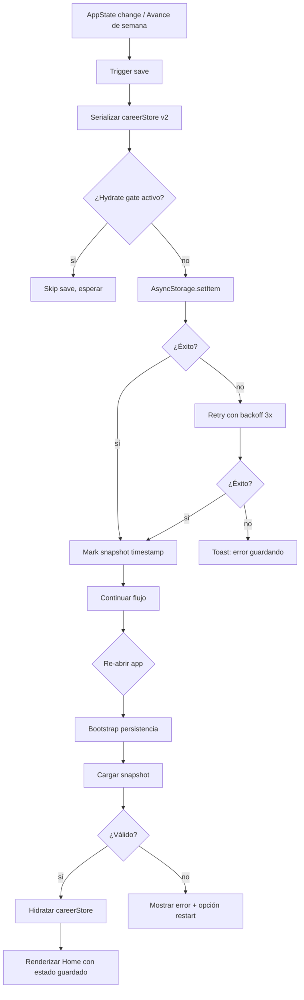

# Save / Load

## Trigger
Snapshot periódico cada vez que el jugador completa un partido o avanza de semana. Save explícito al cerrar la app (`AppState.background`) o al detectar force-stop imminente.

## Actor
Sistema (auto-save scheduler + persistencia AsyncStorage) + usuario jugador (no requiere acción manual salvo reset explícito).

## Diagrama

## Steps

### Step 1: Trigger save
- **Pantalla / Componente**: `src/features/persistence/save-scheduler.ts`.
- **Acción del usuario**: Completa un partido, avanza semana o cierra la app.
- **Acción del sistema**: Llama `scheduleSave()` con debounce 500ms; múltiples triggers coalescen.
- **Resultado esperado**: Un solo save batch por ciclo.
- **Caminos alternativos**: Save ya en flight → queue; force-stop antes del flush → persiste snapshot previo (AC7 MGC-421).

### Step 2: Serializar careerStore v2
- **Pantalla / Componente**: `src/features/career/career-store.ts`.
- **Acción del usuario**: Implícita.
- **Acción del sistema**: `JSON.stringify(careerStore)` excluyendo campos volátiles (timers, listeners activos).
- **Resultado esperado**: Payload serializado < 100KB típicamente.
- **Caminos alternativos**: Payload > 1MB → warning en dev mode (señal de crecimiento anormal).

### Step 3: Verificar hydrate gate
- **Pantalla / Componente**: `src/features/persistence/hydrate-gate.ts`.
- **Acción del usuario**: Implícita.
- **Acción del sistema**: Verifica que `loadCurrentSnapshot()` no esté corriendo; si lo está, skip save para evitar race condition.
- **Resultado esperado**: Save se difiere si hydrate está en curso.
- **Caminos alternativos**: Hydrate timeout > 5s → forzar save igual (gate defensivo).

### Step 4: Persistir AsyncStorage
- **Pantalla / Componente**: `src/features/persistence/async-storage-driver.ts`.
- **Acción del usuario**: Implícita.
- **Acción del sistema**: `AsyncStorage.setItem('copero-career-v2', payload)`. Acuda con flush completo.
- **Resultado esperado**: Storage actualizado con timestamp.
- **Caminos alternativos**: Storage lleno → error; quota excedida → retry con cleanup de keys legacy.

### Step 5: Retry con backoff
- **Pantalla / Componente**: `src/features/persistence/retry-policy.ts`.
- **Acción del usuario**: Implícita (post-falla).
- **Acción del sistema**: Reintenta 3 veces con backoff 1s, 2s, 4s. Si tras 3 intentos falla → toast.
- **Resultado esperado**: 99% de saves exitosos en condiciones normales.
- **Caminos alternativos**: Falla persistente → abrir ticket `bug`; backup key legacy `copero-career` queda intacta.

### Step 6: Bootstrap al reabrir app
- **Pantalla / Componente**: `src/features/persistence/bootstrap.ts` (MGC-722).
- **Acción del usuario**: Reabre la app.
- **Acción del sistema**: `bootstrapPersistence()` se ejecuta en layouts native/web; configura listener `AppState` para auto-save.
- **Resultado esperado**: Listener activo, gate listo para hidratar.
- **Caminos alternativos**: Cold start tras force-stop → mismo path; listener ya estaba activo → cleanup previo.

### Step 7: Cargar snapshot
- **Pantalla / Componente**: `src/features/persistence/loader.ts`.
- **Acción del usuario**: Implícita.
- **Acción del sistema**: `AsyncStorage.getItem('copero-career-v2')`, parsea JSON, valida schema v2.
- **Resultado esperado**: Snapshot parseado y validado.
- **Caminos alternativos**: Key legacy `copero-career` → back-compat (MGC-385); JSON corrupto → fallback a legacy + warning.

### Step 8: Hidratar careerStore
- **Pantalla / Componente**: `src/features/career/career-store.ts#hydrate`.
- **Acción del usuario**: Implícita.
- **Acción del sistema**: Reemplaza careerStore con datos del snapshot; dispatch evento `career.hydrated`.
- **Resultado esperado**: Store hidratado idéntico al último save.
- **Caminos alternativos**: Snapshot incompleto → usa defaults para campos faltantes; backup legacy activo.

### Step 9: Renderizar Home con estado guardado
- **Pantalla / Componente**: `app/simulador-carrera/home.tsx`.
- **Acción del usuario**: Ve Home.
- **Acción del sistema**: Renderiza Home con semana actual, equipo, stats y trophies del snapshot.
- **Resultado esperado**: Continúa exactamente donde dejó (AC7 MGC-421).
- **Caminos alternativos**: Post-process-death redirect a stage persistido (MGC-726); 0→home si stage desconocido.

## Edge cases
| Escenario | Comportamiento esperado |
|-----------|-------------------------|
| Force-stop durante save | Snapshot previo persiste; al reabrir, hidrata desde ese snapshot. |
| AsyncStorage corrupto | Fallback a legacy key `copero-career` (MGC-385). |
| Migración v1 → v2 | Auto-upgrade transparente con datos preservados. |
| Save concurrente con load | Hydrate gate previene conflicto. |
| Storage quota excedido | Retry con cleanup de keys legacy + warning al usuario. |
| Snapshot con campos faltantes | Defaults aplicados para los campos null; warning en consola dev. |
| Auto-redirect a stage persistido post process-death (MGC-726) | Deep-link a la pantalla correcta basada en stage activo. |
| Web bundle (copero-web) | localStorage en lugar de AsyncStorage; misma API. |

## Pre-condiciones
- App instalada y persistencia inicializada.
- AsyncStorage disponible (o localStorage en web).
- `bootstrapPersistence` ejecutado en mount.

## Post-condiciones
- Snapshot persistido bajo key `copero-career-v2`.
- CareerStore hidratado idéntico al último estado.
- Home renderiza con datos guardados.
- Telemetría `analytics.save_completed` emitida (opcional).

## Validación
- E2E: `tests/e2e/save-load.spec.ts` cubre advance → force-stop → reopen.
- Unit: `src/features/persistence/loader.test.ts` cubre back-compat v1 → v2.
- Métricas: `analytics.save_completed { durationMs, payloadKB }`.
- QA: corrida manual valida snapshot AC7 post force-stop (MGC-421).

## Dependencias externas
- `@react-native-async-storage/async-storage` (mobile) / `localStorage` (web).
- `react-native-app-state` listener.
- Hidrate gate para evitar race conditions.
- Back-compat shim para save legacy v1.

## Out of scope
- Sincronización cloud entre dispositivos.
- Sistema de múltiples slots de save (solo 1 slot activo).
- Versionado automático con rollback a save anterior.
- Cifrado end-to-end del snapshot (futuro feature).