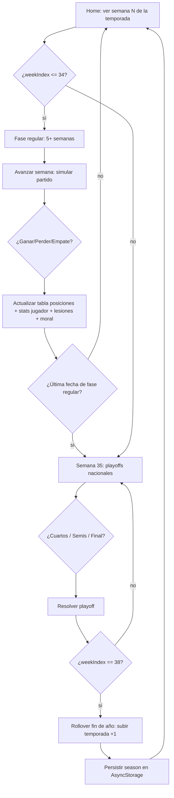

# Temporada loop 5+ semanas + playoffs + fin de año

## Trigger
Inicio de la pantalla Home del simulador de карьera al detectar que el `weekIndex` actual pertenece a la temporada regular (semanas 1–34) o a la fase de playoffs (semanas 35–38), o al cerrar la semana 38 y disparar el rollover de fin de año.

## Actor
Usuario jugador (avanza semana con la UI) + sistema (motor RNG determinista que resuelve partidos, lesiones, moral y fin de año).

## Diagrama

## Steps

### Step 1: Ver calendario semanal jugable
- **Pantalla / Componente**: `app/simulador-carrera/calendar.tsx` + `src/features/simulador-carrera/screens/calendar.tsx`.
- **Acción del usuario**: Toca el día actual del calendario (semana N de la temporada activa).
- **Acción del sistema**: Lee `careerStore.currentWeek` y `careerStore.currentSeason`, renderiza badge con número de semana y temporada (e.g. "Temporada 3 · Semana 12").
- **Resultado esperado**: Calendario muestra el día habilitado, próximos 7 días visibles, navegación a la pantalla partido.
- **Caminos alternativos**: Si `currentSeason == null` → fallback a onboarding; si el día está bloqueado por lesión activa → badge rojo "lesionado".

### Step 2: Avanzar semana — simular partido
- **Pantalla / Componente**: `app/simulador-carrera/match.tsx` (match engine F2 + decisión árbol F3).
- **Acción del usuario**: Toca "Jugar partido" en la card de partido programado.
- **Acción del sistema**: Resuelve el partido vía `simulateMatch()` (RNG determinista ADR-0016), calcula goles, lesiones post-match (`maybeRollInjury`), eventos sociales (F4) y actualiza `matchHistory`.
- **Resultado esperado**: Pantalla muestra resultado final, goleadores, lesionados y morale del equipo.
- **Caminos alternativos**: Partido suspendido → modal "Reprogramar"; equipo sin 11 jugadores → alineación automática forzada desde `bestPlayerByPosition`.

### Step 3: Actualizar tabla de posiciones y stats del jugador
- **Pantalla / Componente**: `src/features/career/weekly-action.ts` + `src/features/career/stats.ts`.
- **Acción del usuario**: Implícita (avance automático post-match).
- **Acción del sistema**: Aplica delta a stats (goles, asist, rating), recalcula `positionFactor` para el partido siguiente, actualiza moral según resultado, persiste en `careerStore`.
- **Resultado esperado**: Stats acumulados visibles en Dashboard; moral `0–100` ajustada.
- **Caminos alternativos**: Empate → moral -2; victoria > 3 goles → moral +8.

### Step 4: Detectar fin de fase regular
- **Pantalla / Componente**: `src/features/career/phase.ts` (`isRegularSeason`, `isPlayoff`).
- **Acción del usuario**: Toca "Avanzar semana" cuando `weekIndex == 34`.
- **Acción del sistema**: Transiciona a playoffs: genera bracket de 8 equipos con los 8 primeros de la tabla, siembra al #1 vs #8.
- **Resultado esperado**: Modal "Inician los playoffs — Fixture" + reseteo de stats semanales (mantiene acumulada).
- **Caminos alternativos**: Tabla con menos de 8 equipos → bye automático a los 4 primeros.

### Step 5: Resolver playoffs (semanas 35–38)
- **Pantalla / Componente**: `src/features/simulador-carrera/screens/playoff.tsx`.
- **Acción del usuario**: Toca cada partido del bracket (cuartos, semis, final).
- **Acción del sistema**: Simula partido único eliminatorio; perdedor sale; campeón persiste en `season.champion`.
- **Resultado esperado**: Bracket actualizado ronda a ronda; campeón con trofeo animado.
- **Caminos alternativos**: Empate en playoff → tanda de penales determinista (`rng.penalties`).

### Step 6: Cerrar semana 38 — rollover fin de año
- **Pantalla / Componente**: `app/simulador-carrera/season-summary.tsx` + `src/features/career/season-rollover.ts`.
- **Acción del usuario**: Toca "Cerrar temporada" tras la final.
- **Acción del sistema**: Incrementa `careerStore.currentSeason`, resetea `weekIndex = 1`, persiste temporada archivada en `history[]`, dispara Modo Copero si hay slot disponible (ver flow modo-copero).
- **Resultado esperado**: Modal "Temporada N cerrada — campeón: <equipo>" + transición a la semana 1 de la temporada N+1.
- **Caminos alternativos**: Jugador en Modo Copero activo → omite rollover hasta cerrar copa.

## Edge cases
| Escenario | Comportamiento esperado |
|-----------|-------------------------|
| Jugador abandona app durante semana 18 | Persistencia AsyncStorage: al reabrir retoma en semana 18 (snapshot AC7). |
| Equipo en zona de descenso (posición 9–10) durante semanas 30–34 | Sin playoff: termina temporada en esa posición; aparece oferta de Modo Copero. |
| Lesión grave del jugador estrella en semana 37 | Reemplazo por `bestPlayerByPosition`; stats reducidas el resto del partido. |
| Empate en fase regular (sin playoff) | Suma 1 punto; tabla ordenada por diferencia de gol. |
| Tabla con menos de 8 equipos | Playoffs degradan: solo los 4 mejores juegan semis+final; bye automático. |

## Pre-condiciones
- Carrera creada vía onboarding (`careerStore.currentSeason >= 1`, `teamId` válido).
- Persistencia AsyncStorage inicializada en layouts (`bootstrapPersistence`, MGC-722).
- Calendario semanal con 38 semanas persistido.

## Post-condiciones
- `careerStore.currentSeason` incrementado al cerrar semana 38.
- `careerStore.history[]` contiene la temporada cerrada con campeón y stats agregadas.
- Stats de jugador actualizadas (goles, asist, rating, lesiones curadas).
- Modo Copero desbloqueado (si aplica).

## Validación
- E2E Playwright: corrida completa 5+ semanas consecutivas (test `tests/e2e/season-loop.spec.ts`).
- Test unitario: `src/features/career/phase.test.ts` cubre transiciones regular → playoff → rollover.
- Métricas: eventos `analytics.season_completed` y `analytics.playoff_started` emitidos.
- QA gate: corrida manual de la suite `qa-evidence-MGC-430/` valida cierre de semana 38.

## Dependencias externas
- AsyncStorage (`@react-native-async-storage/async-storage`) para persistencia.
- RNG determinista (ADR-0016) — semilla fija para tests reproducibles.
- Modal de celebración nativa (`react-native-reanimated`).
- i18n (ver flow `i18n-es-en-pt`).

## Out of scope
- Modo online multijugador entre carreras.
- Sistema de copa nacional (cubierto por flow `modo-copero`).
- Editor de calendario manual (la app lo calcula automáticamente).
- Sistema de descenso/ascenso entre divisiones (futuro feature).